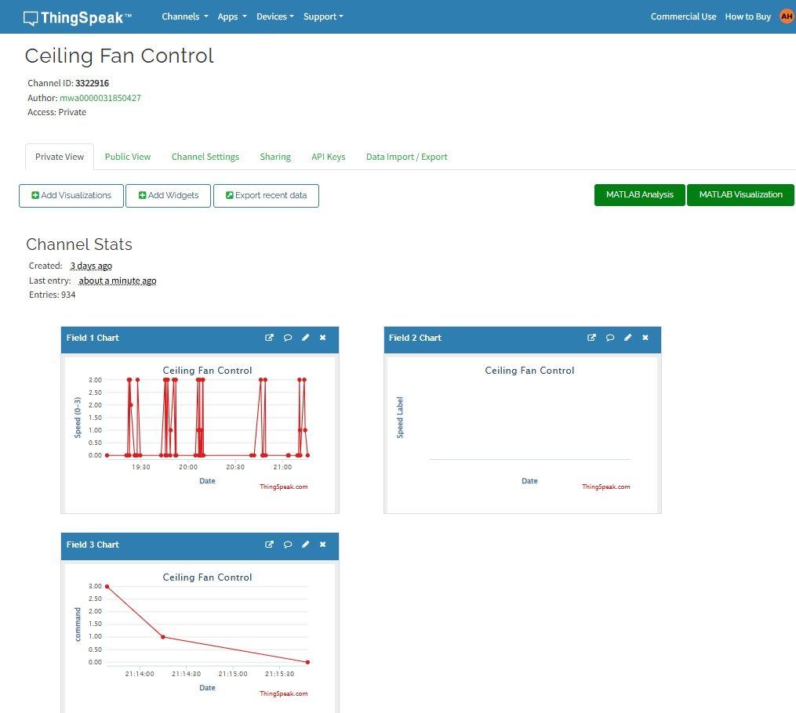
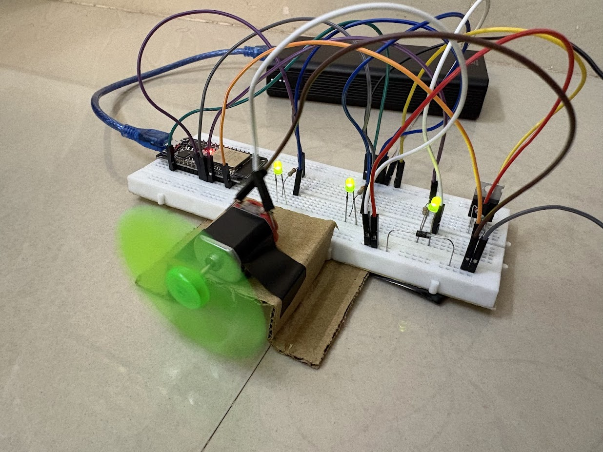
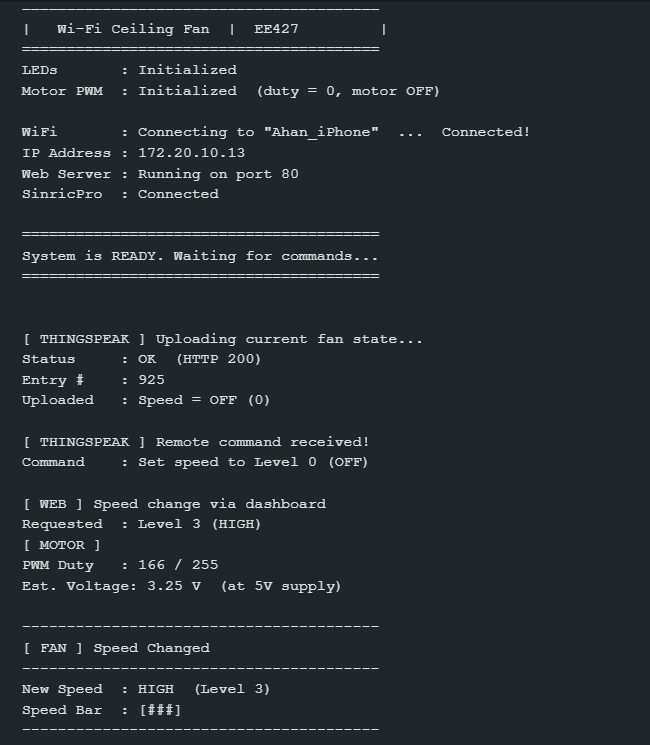

# SmartFan-IoT-Control

ESP32-based IoT fan-speed simulation with local web control, SinricPro cloud integration, and ThingSpeak logging.

---

## Overview

**SmartFan-IoT-Control** is a simulation-first mini project built on **ESP32 WROOM**.

It supports four fan states:

- `0` — OFF
- `1` — LOW
- `2` — MEDIUM
- `3` — HIGH

> **Note:** This project does **not** control a real AC fan.  
> Fan behavior is simulated using GPIO outputs and LEDs and a toy DC Motor.

---

## Features

- ESP32 local web dashboard
- SinricPro cloud control
- ThingSpeak logging
- LED-based fan speed simulation
- Serial Monitor status output
- Clean state mapping for OFF / LOW / MEDIUM / HIGH

---

## Project Images

> Update these paths if your image filenames are different.

### Dashboard


### Hardware Setup


### Serial Monitor


---

## How It Works

### Active Controls
1. **ESP32 local dashboard**
   - Route: `/set?speed=0..3`
2. **SinricPro**
   - Power callback
   - Range callback

Both inputs call the same internal function: `applyFanSpeed()`.

### Active Outputs
- GPIO LED updates
- Serial logs
- ThingSpeak updates

---

## ThingSpeak Field Mapping

| Field | Used By | Direction | Purpose |
|------|---------|-----------|---------|
| Field 1 | `main.ino` | ESP32 → ThingSpeak | Numeric speed value (`0..3`) |
| Field 2 | `main.ino` | ESP32 → ThingSpeak | Speed label (`OFF`, `LOW`, `MEDIUM`, `HIGH`) |
| Field 3 | `index.html` | UI → ThingSpeak | Command speed (`0..3`) |

> Current firmware does **not** poll `Field 3`, so `index.html` cannot control the ESP32 unless polling is added.

---

## Hardware Requirements

- ESP32 WROOM
- 3 external LEDs
- Onboard LED for power/status
- Breadboard
- Jumper wires
- Current-limiting resistors

### GPIO Mapping

| GPIO | Purpose |
|------|---------|
| 2 | Power LED |
| 18 | LOW LED |
| 19 | MEDIUM LED |
| 21 | HIGH LED |

### LED Behavior

| Fan State | LEDs On |
|----------|---------|
| OFF | None |
| LOW | LOW |
| MEDIUM | LOW + MEDIUM |
| HIGH | LOW + MEDIUM + HIGH |

---

## Technologies Used

### Firmware
- Arduino IDE
- `WiFi.h`
- `WebServer.h`
- `HTTPClient.h`
- `SinricPro.h`
- `SinricProFanUS.h`

### Cloud and UI
- ThingSpeak
- SinricPro
- Browser-based dashboard

---

## Repository Structure

```text
SmartFan-IoT-Control/
├── main.ino
├── index.html
├── README.md
└── images/
    ├── dashboard.png
    ├── hardware-setup.png
    ├── thingspeak-data.png
    └── serial-output.png
```

---

## Setup Instructions

### 1. Open the project
Open the repository in **Arduino IDE** or **VS Code**.

### 2. Install required libraries
Install these libraries in Arduino IDE:

- WiFi
- WebServer
- HTTPClient
- SinricPro
- SinricProFanUS

### 3. Configure credentials
Open `main.ino` and update:

- Wi-Fi SSID
- Wi-Fi password
- ThingSpeak Write API Key
- ThingSpeak Channel ID
- SinricPro App Key
- SinricPro App Secret
- SinricPro Device ID

### 4. Upload to ESP32
- Select the correct ESP32 board
- Select the correct COM port
- Upload `main.ino`

### 5. Open Serial Monitor
- Set the correct baud rate
- Note the ESP32 local IP address after boot

### 6. Open the dashboard
Use the ESP32 IP address in a browser to control fan speed locally.

---

## Usage

### Local Web Control
Use the ESP32 dashboard or this endpoint:

```text
/set?speed=0
/set?speed=1
/set?speed=2
/set?speed=3
```

### SinricPro Control
Use the SinricPro device to change fan speed from the cloud.

### ThingSpeak Logging
The ESP32 sends:
- numeric speed value
- speed label

---

## Results

When the project is working correctly:

- The selected fan speed is shown in the dashboard
- LEDs reflect the current speed state
- Serial Monitor shows live updates
- ThingSpeak receives periodic values
- SinricPro commands update the same fan state

---

## Current Limitations

- Simulation only, no real fan switching
- ThingSpeak updates are rate-limited
- `index.html` writes to `Field 3`, but the current firmware does not read it

---

## Future Improvements

- Add ThingSpeak polling for `Field 3`
- Add automatic speed control based on temperature
- Add OTA firmware updates
- Move credentials to a separate secrets file
- Improve UI design and responsiveness

---

## License

MIT License
